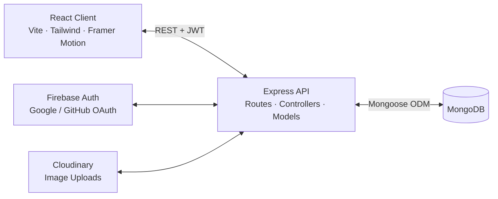
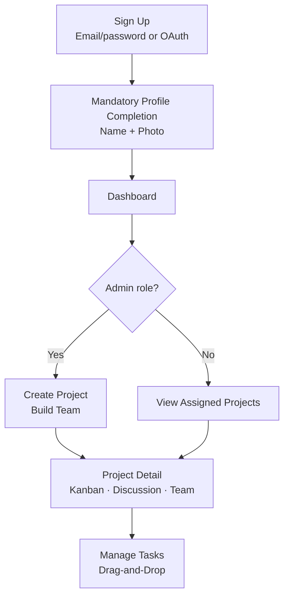

# ToggleNest


## Project Overview

ToggleNest is a team task and workflow management platform built on the MERN stack (**M**ongoDB, **E**xpress, **R**eact, **N**ode.js). It centers all work around projects: admins create projects, assemble teams, and manage membership, while members focus on the boards they have been assigned to. Every project ships with a drag-and-drop Kanban board, a shared discussion feed, and a full activity trail, so the whole team can see what is happening and what comes next.

Access is role-based and enforced live from the database — changing a user's role takes effect immediately, with no re-login required. Before entering the app, every new user completes a mandatory profile onboarding step (name + profile photo), and sign-ups can happen via email/password or Google/GitHub single sign-on. The dashboard tracks completion progress and breaks tasks down by status and priority with charts, while the backend keeps everything secure with JWT authentication, bcrypt-hashed passwords, rate limiting, input sanitization, and centralized error handling.

## Live Demo

- Frontend: https://toggle-nest-gules.vercel.app/
- Backend API Docs: https://togglenest-h7jk.onrender.com/api-docs/

## ✅ Key Features

**Authentication**
- Email/password signup and login
- Google and GitHub OAuth single sign-on via Firebase
- Mandatory profile onboarding (name + photo) before accessing the app

**Role-Based Access Control**
- **Admin** — full access: project creation, editing, deletion, and team management
- **Member** — access limited to assigned projects and their task management
- Roles sync live from the database, no re-login required

**Project Management**
- Full CRUD with member assignment
- Project-scoped access — members only see the projects they're assigned to

**Kanban Board**
- Drag-and-drop task management across To-Do / In Progress / Done
- Boards strictly isolated per project

**Task Management**
- Priority levels, due dates, assignment, and status tracking

**Project Discussion**
- Per-project comment threads with a real-time-feel polling experience

**Activity Logging**
- Full audit trail of task and project changes

**Notifications**
- In-app notifications for task assignments and status changes

**Dashboard**
- Completion tracking with a circular progress indicator
- Status and priority breakdown charts (donut + bar)

**Security**
- JWT authentication and bcrypt password hashing
- Rate limiting, mongo-sanitize (NoSQL injection), and hpp (HTTP parameter pollution) protection
- Centralized error handling and input validation

## Tech Stack

| Layer | Technology |
|---|---|
| Frontend | React + Vite, Tailwind CSS, Framer Motion |
| Backend | Node.js + Express |
| Database | MongoDB + Mongoose (ODM) |
| Authentication | Firebase Authentication (Google / GitHub OAuth) + JWT |
| Image Uploads | Cloudinary |
| API Documentation | Swagger (swagger-jsdoc + swagger-ui-express) |
| Charts | Recharts |
| Security | bcrypt, Helmet, express-rate-limit, express-validator, mongo-sanitize, hpp |

## System Architecture



## User Flow



## 🔒 Role-Based Access

| Action | Admin | Member |
|---|---|---|
| Create project | ✅ | ❌ |
| Edit project | ✅ | ❌ |
| Delete project | ✅ | ❌ |
| Manage team (members) | ✅ | ❌ |
| View all projects | ✅ | ❌ |
| View assigned projects | ✅ | ✅ |
| Create / edit / delete tasks | ✅ | ✅ |
| Assign tasks | ✅ | ✅ |
| Drag-and-drop on Kanban | ✅ | ✅ |
| Comment on discussion | ✅ | ✅ |
| Delete own comment | ✅ | ✅ |
| Delete any comment | ✅ | ❌ |
| View dashboard | ✅ | ✅ |

## 📁 Project Structure

```
togglenest/
├── backend/
│   ├── config/           # env, swagger, cloudinary, firebase setup
│   ├── controllers/      # auth, project, task, comment, activity, notification logic
│   ├── middleware/       # auth guard, validation, error handler
│   ├── models/           # MongoDB schemas (User, Project, Task, Comment, ...)
│   ├── routes/           # Express route definitions with Swagger annotations
│   ├── tests/            # integration tests
│   └── server.js         # backend entry point
└── frontend/
    ├── src/
    │   ├── api/          # axios API client modules
    │   ├── components/   # shared UI (Layout, modals, Kanban, charts, discussion)
    │   ├── context/      # auth and theme React contexts
    │   ├── pages/        # route-level screens (Dashboard, Projects, ProjectDetail, ...)
    │   ├── App.jsx       # route definitions
    │   ├── firebase.js   # Firebase client configuration
    │   └── main.jsx      # frontend entry point
    └── index.html
```

## Planned / In Progress

- **Microsoft OAuth** — planned, not yet implemented.
- **Fine-grained per-project permissions** — project-level member assignment is in place; more granular permissions inside a project are still being refined.

## Backend API

For backend setup and API documentation, see the backend README:

- [backend/README.md](backend/README.md)

## Backend API Endpoints

Base URL: `http://localhost:5000/api`

### Auth

#### Register user
- Method: `POST`
- Endpoint: `/auth/register`
- Request body:
```json
{
  "name": "John Doe",
  "email": "john@example.com",
  "password": "secret123",
  "role": "member"
}
```
- Example success response:
```json
{
  "success": true,
  "data": {
    "message": "User registered successfully"
  }
}
```

#### Login user
- Method: `POST`
- Endpoint: `/auth/login`
- Request body:
```json
{
  "email": "john@example.com",
  "password": "secret123"
}
```
- Example success response:
```json
{
  "success": true,
  "data": {
    "message": "Login successful",
    "token": "jwt_token_here",
    "user": {
      "id": "user_id",
      "name": "John Doe",
      "email": "john@example.com",
      "role": "member"
    }
  }
}
```

#### Get profile
- Method: `GET`
- Endpoint: `/auth/profile`
- Headers:
```http
Authorization: Bearer <token>
```
- Example success response:
```json
{
  "success": true,
  "data": {
    "message": "You accessed a protected route!",
    "user": {
      "_id": "user_id",
      "name": "John Doe",
      "email": "john@example.com",
      "role": "member"
    }
  }
}
```

### Projects

#### Create project
- Method: `POST`
- Endpoint: `/projects`
- Request body:
```json
{
  "name": "Website Redesign",
  "description": "Update the marketing website",
  "deadline": "2026-09-15T00:00:00.000Z",
  "createdBy": "user_id"
}
```
- Example success response:
```json
{
  "success": true,
  "data": {
    "_id": "project_id",
    "name": "Website Redesign",
    "description": "Update the marketing website"
  }
}
```

#### Get all projects
- Method: `GET`
- Endpoint: `/projects`
- Example success response:
```json
{
  "success": true,
  "data": [
    {
      "_id": "project_id",
      "name": "Website Redesign"
    }
  ]
}
```

### Tasks

#### Create task
- Method: `POST`
- Endpoint: `/tasks`
- Request body:
```json
{
  "title": "Build login screen",
  "description": "Create the dashboard login UI",
  "status": "To-Do",
  "priority": "High",
  "dueDate": "2026-09-10T00:00:00.000Z",
  "project": "project_id",
  "assignedTo": "user_id",
  "createdBy": "user_id"
}
```
- Example success response:
```json
{
  "success": true,
  "data": {
    "_id": "task_id",
    "title": "Build login screen",
    "status": "To-Do",
    "priority": "High",
    "assignedTo": {
      "_id": "user_id",
      "name": "John Doe",
      "email": "john@example.com"
    }
  }
}
```

#### Get tasks with pagination
- Method: `GET`
- Endpoint: `/tasks?page=1&limit=10`
- Optional query: `project=<project_id>`
- Example success response:
```json
{
  "success": true,
  "data": [
    {
      "_id": "task_id",
      "title": "Build login screen",
      "status": "To-Do",
      "priority": "High",
      "assignedTo": {
        "_id": "user_id",
        "name": "John Doe",
        "email": "john@example.com"
      }
    }
  ],
  "pagination": {
    "total": 25,
    "page": 1,
    "limit": 10,
    "totalPages": 3
  }
}
```

#### Get task by ID
- Method: `GET`
- Endpoint: `/tasks/:id`
- Example success response:
```json
{
  "success": true,
  "data": {
    "_id": "task_id",
    "title": "Build login screen",
    "status": "In Progress",
    "priority": "High"
  }
}
```

#### Update task
- Method: `PUT`
- Endpoint: `/tasks/:id`
- Request body:
```json
{
  "title": "Build login screen v2",
  "status": "In Progress",
  "priority": "High"
}
```
- Example success response:
```json
{
  "success": true,
  "data": {
    "_id": "task_id",
    "title": "Build login screen v2",
    "status": "In Progress"
  }
}
```

#### Update task status
- Method: `PATCH`
- Endpoint: `/tasks/:id/status`
- Request body:
```json
{
  "status": "Done"
}
```
- Example success response:
```json
{
  "success": true,
  "data": {
    "_id": "task_id",
    "title": "Build login screen",
    "status": "Done"
  }
}
```

#### Delete task
- Method: `DELETE`
- Endpoint: `/tasks/:id`
- Example success response:
```json
{
  "success": true,
  "data": {
    "message": "Task deleted"
  }
}
```

### Activity Logs

#### Get all activity logs
- Method: `GET`
- Endpoint: `/activity-logs`
- Example success response:
```json
{
  "success": true,
  "data": [
    {
      "_id": "log_id",
      "task": "task_id",
      "action": "Status changed to Done",
      "performedBy": {
        "_id": "user_id",
        "name": "John Doe",
        "email": "john@example.com"
      },
      "timestamp": "2026-08-29T12:00:00.000Z"
    }
  ]
}
```

### Dashboard

#### Get dashboard summary
- Method: `GET`
- Endpoint: `/dashboard/summary?project=<project_id>`
- Example success response:
```json
{
  "success": true,
  "data": {
    "totalTasks": 12,
    "tasksByStatus": {
      "To-Do": 4,
      "In Progress": 5,
      "Done": 3
    },
    "tasksByPriority": {
      "Low": 3,
      "Medium": 5,
      "High": 4
    }
  }
}
```

## Error Handling

The backend uses a centralized error middleware and returns consistent error payloads:

```json
{
  "success": false,
  "message": "Task not found"
}
```

Typical HTTP statuses:
- `400` for validation or bad input
- `401` for unauthorized access
- `404` for missing routes or resources
- `429` for rate limiting
- `500` for server errors

## 🚀 Local Setup Instructions

### 1. Install dependencies

Install dependencies for both backend and frontend:

```bash
cd backend
npm install
cd ../frontend
npm install
```

### 2. Set backend environment variables

Create a `.env` file inside the `backend` folder with:

```env
PORT=5000
MONGO_URI=mongodb://localhost:27017/togglenest
JWT_SECRET=your_super_secret_key
NODE_ENV=development
FIREBASE_SERVICE_ACCOUNT_PATH=./config/firebase-service-account.json
```

Required variables:
- `PORT` - port for the backend server
- `MONGO_URI` - MongoDB connection string
- `JWT_SECRET` - secret used to sign JWT tokens
- `FIREBASE_SERVICE_ACCOUNT_PATH` - path to the Firebase Admin SDK service account JSON (see note below)
- `NODE_ENV` - optional, typically `development` or `production`

> **Firebase service account:** `FIREBASE_SERVICE_ACCOUNT_PATH` points to the Firebase Admin SDK service account JSON used to verify Google/GitHub login tokens. This file is **gitignored** and must be added manually — never commit it. Download it from Firebase Console > Project settings > Service accounts > Generate new private key, then save it where your `.env` entry points (e.g. `backend/config/firebase-service-account.json`).

### 3. Start MongoDB

Make sure MongoDB is running locally on your machine or use a MongoDB connection URI pointing to a remote cluster.

### 4. Run the backend

```bash
cd backend
npm run dev
```

For production-style runs:

```bash
cd backend
npm start
```

The backend should run at `http://localhost:5000`.

### 5. Run the frontend

```bash
cd frontend
npm run dev
```

The frontend should run at `http://localhost:5173`.

## 🚀 Deployment Checklist

Before going live, remember to:

- **Frontend:** set `VITE_API_URL` to your production API URL before building, e.g. `VITE_API_URL=https://api.example.com` or `VITE_API_URL=https://api.example.com/api`. The frontend auto-appends `/api` if it isn't already present (see `frontend/src/api/axiosInstance.js`). Vite inlines env vars at build time, so the production bundle must be built with the correct value. See `frontend/.env.example`.
- **Backend:** set `PORT`, `MONGO_URI`, `JWT_SECRET`, `NODE_ENV=production`, and the production frontend URL(s) in `FRONTEND_URL` (comma-separated, used for CORS). Provide the Firebase service account via `FIREBASE_SERVICE_ACCOUNT_JSON` (JSON string — preferred for hosted platforms where you can't upload a file) or `FIREBASE_SERVICE_ACCOUNT_PATH` (file path). See `backend/.env.example`.
- **Firebase Console:** add the production frontend URL under Authentication > Settings > **Authorized domains**, and add it as an **authorized redirect URI** for the Google and GitHub sign-in providers.
- **GitHub OAuth app:** add the production frontend URL as an **authorized callback / redirect URI** in the GitHub OAuth app settings (Settings > Developer settings > OAuth Apps), in addition to any localhost entries.
- **JWT secret:** use a long, random, unique value in production — never reuse a local development secret.

## Notes

- All protected routes require a valid JWT token in the `Authorization` header.
- Most route validations enforce task field rules such as required title and valid status/priority values.
- The API uses pagination for task lists and basic rate limiting for abuse protection.

## Contributors

- Atharva Jadhav
- Sarangi Jawale
- Vedant Sawant
- Shraddha Das
- Shreya Karande

## License

This project is licensed under the MIT License - see the LICENSE file for details.
